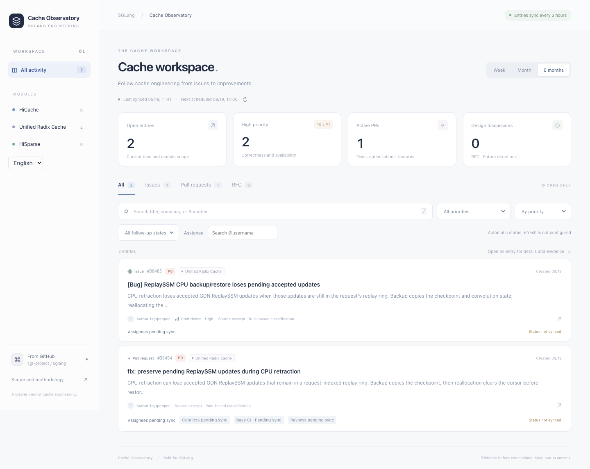
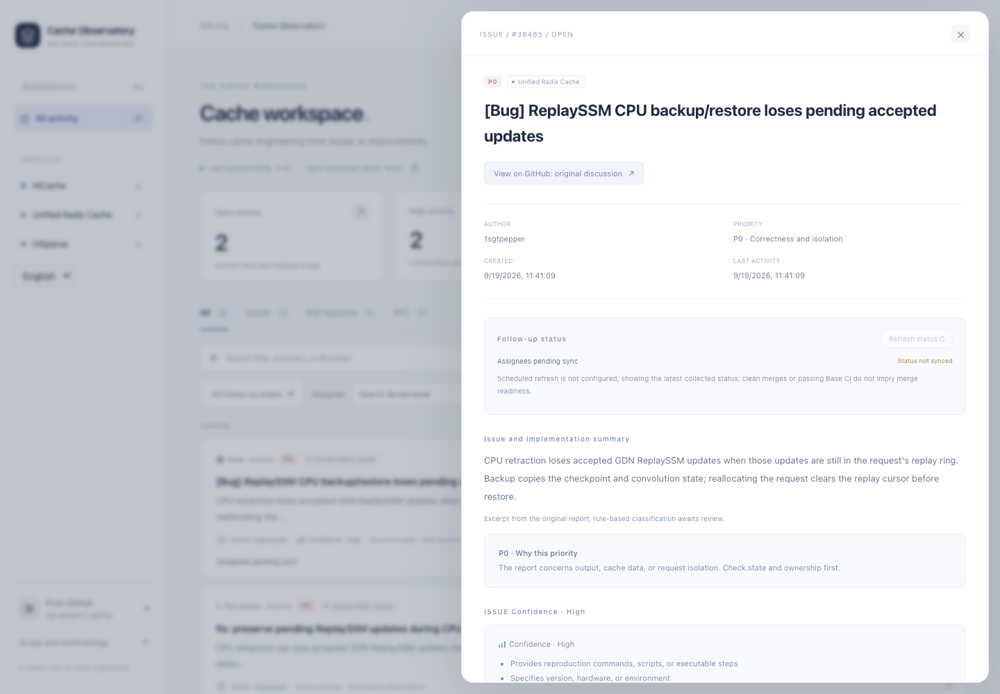
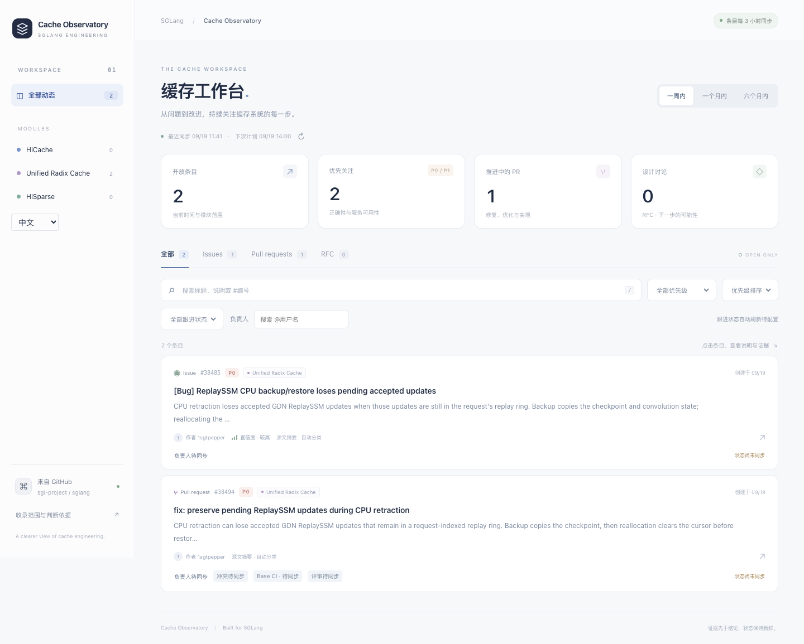
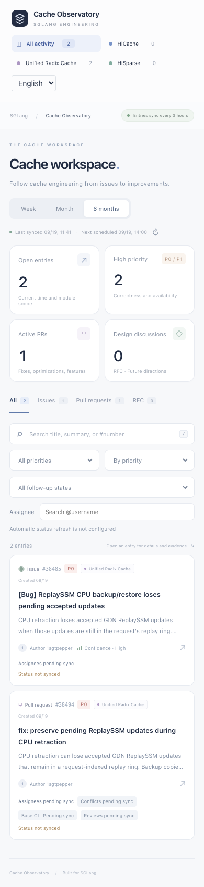

<div align="center">


# Repo Observatory

**A clearer view of engineering.**

Issues, pull requests, reviews, and CI.<br>
One focused workspace for the work worth following.

[](https://github.com/alphabetc1/repo-observatory/actions/workflows/tests.yml)


[Explore the UI](#in-action) · [Try it locally](#try-the-demo) · [Quick start](#run-locally) · [Configure a workspace](#configuration)

</div>

<br>

[](docs/images/desktop-en.png)

<p align="center"><sub>The SGLang cache profile, shown with recorded public test data. Screenshots are demonstrations, not live repository status.</sub></p>

## Less tab-hopping. More context.

Follow the modules you maintain without piecing together an issue tracker, PR list, and CI dashboard. Repo Observatory brings the evidence into one self-hosted workspace.

| Find the work | Understand the evidence | Follow it through |
| --- | --- | --- |
| Configurable module matching | Source excerpts and editorial notes | Assignees and requested reviewers |
| Issue, PR, and RFC filters | Explained rule-based priorities | Draft and merge-conflict state |
| Time, owner, and priority filters | Report completeness signals | CI tied to the current PR commit |

**Lightweight by design.** Python's standard library at runtime. Static HTML, JavaScript, and CSS. JSON snapshots and SQLite accounts. No frontend build step, external database, or mandatory AI service.

## In action

### From a headline to the evidence

Open an entry to inspect the original report, priority reasoning, evidence signals, and follow-up status without losing your place.

[](docs/images/detail-en.png)

### English or Chinese. Desktop or phone.

Switch the interface language while preserving the original GitHub text. The same workspace adapts to smaller screens.

<details>
<summary><strong>See the Chinese workspace</strong></summary>

<br>

[](docs/images/desktop-zh.png)

</details>

<details>
<summary><strong>See the mobile workspace</strong></summary>

<br>

<p align="center">
  <a href="docs/images/mobile-390-en.png"></a>
</p>

</details>

<br>

The screenshots show **Cache Observatory**, the original SGLang profile. Configure another repository and its modules to make the workspace your own. Each instance watches one repository; multiple repositories use separate instances.

## Try the demo

**No GitHub token required.** Preview the real interface using the included public fixtures:

```sh
git clone https://github.com/alphabetc1/repo-observatory.git
cd repo-observatory
python3 tests/serve_fixture.py
```

Open the local URL printed by the command. Demo data is temporary and removed when the process exits normally. This is a local preview, not a live GitHub sync.

## Run locally

Requires **Python 3.10+**. For live collection, authenticate the GitHub CLI with `gh auth login`, then run from the repository directory:

```sh
export OBSERVATORY_CONFIG="$PWD/configs/sglang.json"
python3 sync.py --data-dir data/sglang --use-gh
python3 pr_status.py --data-dir data/sglang --use-gh
python3 server.py --data-dir data/sglang --port 8787
```

Open http://127.0.0.1:8787. `--use-gh` uses an existing GitHub CLI login locally. Alternatively set `GITHUB_TOKEN` in the process environment. Never commit credentials. The initial sync can require many GitHub requests; later syncs are incremental. Schedule entry sync every three hours and workflow collection every 30 minutes using your scheduler; the application does not install timers.

## Configuration

`OBSERVATORY_CONFIG` selects a JSON configuration. The SGLang profile preserves the original cache modules. Copy `configs/example.json` to a gitignored `*.local.json` to watch another repository and configure module regexes, a CI workflow, event, and default language.

Each running workspace watches **one repository**. Run separate processes, ports, and data directories for multiple repositories. A combined cross-repository dashboard is not implemented. Entries expose a repository-qualified `id`; state files reject a different repository to prevent accidental reuse. Do not change a workspace repository while it is running.

Manual notes live in `<data-dir>/editorial.json`, keyed by issue number within that workspace. Runtime snapshots and account databases are never source files. A failed collection retains the previous complete snapshot.

## Languages

Choose **中文 / English** in the dashboard sidebar or account pages. The preference is stored in a same-origin cookie and survives reloads; `default_language` controls the initial setting. Application labels, errors, methodology, and rule explanations are localized. GitHub titles, bodies, author text, and manual notes retain their original language.

`locales/en.json` contains application-copy translations. The server renders the existing HTML/JS assets in the selected language without duplicating the UI. JSON localization only touches application-owned fields. Stylesheets and the dashboard structure are preserved; only the language control is added.

## Optional analysis interface

**An extension point, not an AI feature claim.** The built-in triage uses rules. LLM analysis is opt-in, disabled by default, and has no bundled provider.

`analysis.py` defines `Analyzer.analyze(AnalysisRequest) -> AnalysisResult`. Set `analyzer` to a **trusted local** `module:factory` to opt in. The factory returns an analyzer. No vendor SDK, model, network endpoint, API key, or paid call is configured.

Results include summary, rationale, suggested priority, provider, model, and version, with source timestamp and language attached by the pipeline. They are stored in `entry.analysis`; GitHub facts, rule priorities, and editorial notes remain authoritative and unchanged. The current UI does not display LLM results. Provider failure records `status: unavailable` and preserves rule-based results without publishing provider exception text.

Before implementing a network provider, add a bounded timeout, source/version-based caching, a cost limit, and provider-specific credential handling outside the repository. Treat issue text as untrusted input. Only configure a provider when sending the watched content to it is authorized. The interface currently runs synchronously during collection.

## Invited access

The server binds to loopback. Local development without authentication must not be exposed through a public proxy. For invited access, set `CACHEBOARD_PUBLIC_ORIGIN` to your HTTPS origin before starting the server, then initialize an administrator:

```sh
python3 access.py --data-dir data/sglang --origin https://observatory.example --bootstrap owner --output data/sglang/owner-setup.json
```

Replace the example origin with your own origin, matching `CACHEBOARD_PUBLIC_ORIGIN`. Store the generated invitation privately; do not include it in logs, commits, or screenshots. Deploy behind your own HTTPS reverse proxy and preserve the SQLite account database and runtime data on updates. This repository contains no host-specific deployment configuration, keys, certificate material, or personal operational notes.

## Verification

```sh
python3 -m unittest discover -s tests -v
npm ci
npx playwright install chromium
npm run test:browser
```

The browser test starts temporary local servers and uses sanitized, recorded public GitHub fixture data. It exercises both languages, details, filters, responsive layouts, and the real invitation/login boundary without contacting a deployed instance. Screenshots are written to gitignored `artifacts/`.

Curated screenshots and their publication rules are documented in [docs/images/README.md](docs/images/README.md).

---

<p align="center"><strong>Evidence before conclusions. Keep status current.</strong><br><sub>Built from Cache Observatory. Configurable beyond cache.</sub></p>
